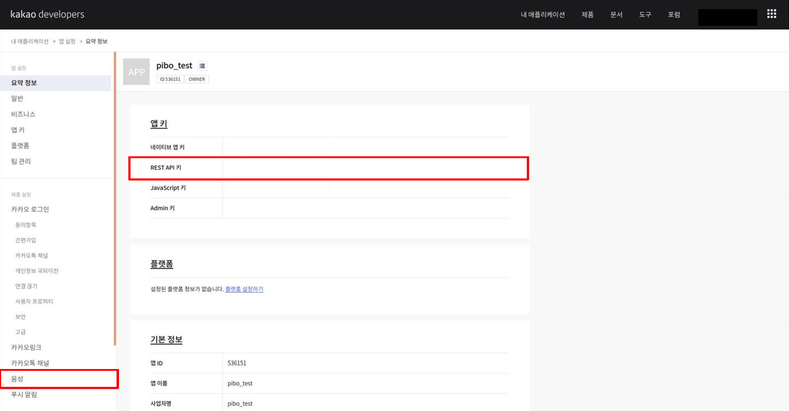
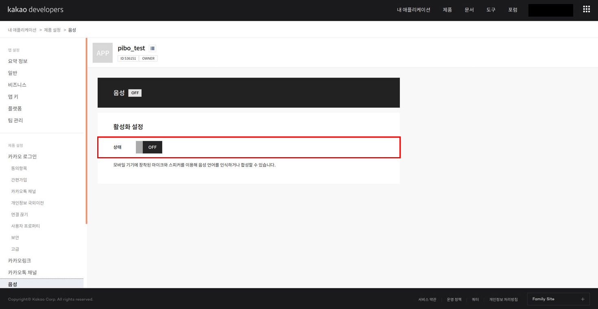
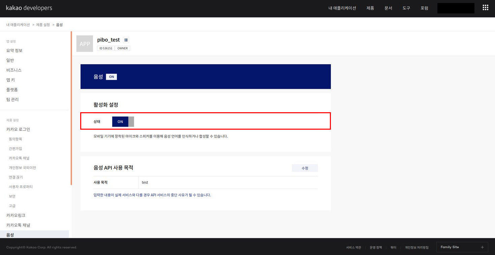

##  1. 설치 및 실행

### 1.1 설치

```shell
~ $ git clone "https://github.com/themakerrobot/openpibo.git"
~ $ git clone "https://github.com/themakerrobot/openpibo-data.git"
~ $ cd openpibo
~/openpibo $ sudo ./install.sh
...
REBOOT NOW? [y/N] # y입력 또는 N 입력 후 sudo reboot
```

#### 1.1.1 APIs

- **Kakao open API** (https://developers.kakao.com/)

  *Speech* 기능을 사용하기 위해  [kakao developers](https://developers.kakao.com/) 회원가입 후 REST API 키를 발급받아야 합니다.

  1. 로그인 후 [내 어플리케이션] 클릭

     

  2. [어플리케이션 추가하기] 클릭

     

  3. 앱 이름 및 사업자명 입력 후 저장

     

  4. 새로 생성한 애플리케이션 클릭

     

  5. config.py에 발급받은 API KEY 입력 후, 왼쪽의 [음성] 클릭

     

     - `openpibo-example/utils/config.py`의 KAKAO_ACCOUNT에 발급받은 REST API KEY 입력

     ```python
     # openpibo-example/utils/config.py
     
     class Config:
       OPENPIBO_PATH="/home/pi/openpibo"
       OPENPIBO_DATA_PATH="/home/pi/openpibo-data"
       TESTDATA_PATH =OPENPIBO_DATA_PATH+"/testdata"
       PROC_PATH =OPENPIBO_DATA_PATH+"/proc"
       MODEL_PATH=OPENPIBO_DATA_PATH+"/models"
       KAKAO_ACCOUNT="YOUR REST API KEY"		# 발급받은 REST API KEY 입력
     ```

  6. 활성화 설정의 [OFF] 버튼 클릭

     

  7. 사용 목적 입력 후 저장

     

  8. 활성화 설정의 상태가 [ON]으로 바뀌면 완료

     

### 1.2 실행

#### 1.2.1 예제 파일 생성

파이보의 기능 테스트를 위한 예제 파일을 생성합니다. 

`openpibo/edu/pibo.py`에 있는 Edu_Pibo 클래스를 호출하여 객체 생성 후 클래스 내의 메서드를 사용합니다.

코드는 아래와 같이 구성할 수 있습니다.


1. 라이브러리 호출 및 경로 설정
   - 코드 작성에 필요한 라이브러리를 호출하고 경로를 설정합니다.
   - `openpibo/edu/pibo.py`에 있는 Edu_Pibo 클래스를 호출합니다. ( `from {module} import {class}` )
2. 함수 작성
   - Edu_Pibo 클래스 내의 메서드를 활용하여 테스트 코드를 작성합니다.
   - `time.sleep()`: 일정 시간동안 프로세스를 정지하는 함수입니다. (단위: 초 / `import time`)
3. 함수 실행을 위한 코드 (`if __name__ == "__main__"` )
   - `__name__`: 현재 모듈의 이름을 담고 있는 내장 변수입니다.
   - 해당 프로그램을 직접 실행했을 경우, 참이 되어 main 함수를 실행합니다.
   - 다른 프로그램에서 import하여 사용할 경우, main 함수는 실행하지 않습니다.

#### 1.2.2 예제 파일 실행

예제파일은 아래의 명령어로 실행할 수 있습니다.

```shell
~ $ cd {폴더명}
~/{폴더명} $ sudo python3 {파일명}
```

아래는 openpibo-example/test 폴더 내에 있는 pibo_test.py를 실행하는 예제입니다.

```shell
~ $ cd openpibo-example/test
~/openpibo-example/test $ sudo python3 pibo_test.py
```


## 2. APIs

### 2.1 Audio

> mp3, wav 파일을 재생 및 정지합니다.

- `pibo.play_audio(filename, out, volume)`

  - 기능: mp3 파일 또는 wav 파일을 재생합니다.
  - 매개변수
    - filename: 재생할 파일의 경로(mp3 / wav)
    - out: 출력대상(local-3.5mm잭 / hdmi / both) [default: local]
    - volume: 음량 크기 (단위: mdB=1/1000dB) [default: -2000]
  - 반환값
    - True(성공)/False(실패), None

  ```python
  pibo.play(filename=cfg.TESTDATA_PATH+"/test.mp3", out='local', volume=-2000)
  ```

- `pibo.stop_audio()`

  - 기능: 오디오 재생을 정지합니다.
  - 반환값
    - True(성공)/False(실패), None

### 2.2 Neopixel

> 파이보의 눈을 제어합니다.

- `pibo.eye_on(color)`

  - 기능: LED를 켭니다.

  - 매개변수

    - color: 색상 - RGB (0~255 숫자) / color(영어 대소문자 모두 가능)

      ( color_list: black, white, red, orange, yellow, green, blue, aqua, purple, pink )
    

  ```python
  pibo.eye_on(255,0,0)	# 양쪽 눈 제어
  pibo.eye_on(0,255,0,0,0,255) # 양쪽 눈 개별 제어
  pibo.eye_on('Red') #'RED', 'red' 가능
  ```

  - 반환값
    - True(성공)/False(실패), None

- `pibo.eye_off()`

  - 기능: LED를 끕니다.
  - 반환값
    - True(성공)/False(실패), None

### 2.3 Device

> 파이보 디바이스 상태를 확인합니다.

- `pibo.check_device(system)`

  - 기능: 디바이스의 상태를 확인합니다.
  - 매개변수
    - system: 확인할 디바이스 (System, Baterry - 영어 대소문자 모두 가능)
  - 반환값
    - True(성공), Device로부터 받은 응답
  - False(실패), None
  
  ```python
  pibo.check_device("battery")
  ```
  
- `pibo.start_devices(func)`

  - 기능: 디바이스의 상태를 확인합니다.
  - 매개변수
    - func: Device로부터 받은 응답을 출력하기 위한 함수
  - 반환값
    - True(성공)/False(실패), None

  ```python
  pibo.start_devices()
  ```

- `pibo.stop_devices()`

  - 기능: 디바이스의 상태 확인을 종료합니다.
  - 반환값
    - True(성공)/False(실패), None

### 2.4 Motion

> 파이보의 움직임을 제어합니다.

- `pibo.motor(n, position, speed, accel)`

  - 기능: 모터 1개를 제어합니다.
  - 매개변수
    - n: 모터 번호(0~9)
    - position: 모터 각도(-80~80)
    - speed: 모터 속도(0~255) [default: None]
    - accel: 모터 가속도(0~255) [default: None]
  - 반환값
    - True(성공), None
    - False(실패), Error code

  ```python
  pibo.motor(2, 30, 100, 10)
  ```

- `pibo.motors(positions, speed, accel)`

  - 기능: 여러 개의 모터를 개별 제어합니다.
  - 매개변수
    - position: 모터 각도(-80~80) 배열( [...] )
    - speed: 모터 속도(0~255) 배열( [...] ) [default: None]
    - accel: 모터 가속도(0~255) 배열( [...] ) [default: None]
  - 반환값
    - True(성공)/False(실패), None

  ```python
  pibo.motors(positions=[0,0,0,10,0,10,0,0,0,20], speed=[0,0,0,15,0,10,0,0,0,10], accel=[0,0,10,5,0,0,0,0,5,10])
  ```

- `pibo.motors_movetime(positions, movetime)`

  - 기능: 입력한 시간 내에 모든 모터를 특정 위치로 이동합니다.
  - 매개변수
    - positions: 0~9번 모터 각도 배열( [...] )
    - movetime: 모터 이동 시간(ms) - 모터가 정해진 위치까지 이동하는 시간 [default: None]
  - 반환값
    -  True(성공)/False(실패), None

  ```python
  pibo.motors_movetime(positions=[0,0,30,20, 30,0, 0,0,30,20], movetime=1000)
  # 1000ms 내에 모든 모터가 [0,0,30,20,30,0,0,0,30,20]의 위치로 이동 
  ```

- `pibo.get_motion(name)`

  - 기능: 모션 종류 및 정보를 조회합니다.
  - 매개변수

    - name: 모션 이름 [default: None]
  - 반환값
    - True(성공), 모션 종류(name==None)/해당 모션 상세 정보 조회(name!=None)
    - False(실패), None

  ```python
  # 모션 목록 조회
  pibo.get_motion()
  # cheer3 상세 정보 조회
  pibo.get_motion("cheer3")
  ```

  > [전체 모션 리스트]
  >
  > stop(2), sleep, lookup, left(2), right(2), forward(2), backward(2),  step(2), hifive, cheer(3), wave(6), think(4), wake_up(3), hey(2),  yes/no, breath(4), head, spin, clapping(2), hankshaking, bow, greeting,  hand(4), foot(2),  speak(9),  welcome, 감정(10), handup(2), look(2),  dance(5), test(5) -  괄호 안은 개수를 의미

- `pibo.set_motion(name, cycle)`

  - 기능: 모션의 동작을 실행합니다.
  - 매개변수
    - name: 모션 이름
    - cycle: 모션 반복 횟수
  - 반환값
    - True(성공), None
    - False(실패), Error code
  
  ```python
  pibo.set_motion("dance1", 5)
  ```

### 2.6 OLED

> OLED Display에 문자, 이미지, 도형을 출력합니다.

OLED 관련 메서드에서는 좌측상단, 우측하단 튜플을 기준으로 문자나 도형을 그립니다. 

만약 좌측상단 좌표가 (10, 10), 우측하단 좌표가 (50, 50)라면 위치는 아래와 같습니다.

 

- `pibo.draw_text(points, text, size)`

  - 기능: 문자를 씁니다. (한글/영어)
  - 매개변수
    -  points: 문자열의 좌측상단 좌표 튜플(x,y)
    - text: 문자열 내용
    - size: 폰트 크기 [default: 10]
  - 반환값
    - True(성공)/False(실패), None

  ```python
  pibo.draw_text((10, 10), '안녕하세요.', 15)
  ```

- `pibo.draw_image(filename)`

  - 기능: 그림을 그립니다. (128X64 파일)
    - 다른 크기의 파일은 지원하지 않습니다.
  - 매개변수
    - filename: 그림 파일의 경로
  - 반환값
    - True(성공), None
    - False(실패), "128X64 파일만 가능합니다."

  ```python
  pibo.draw_image(cfg.TESTDATA_PATH +"/clear.png")
  ```

- `pibo.draw_figure(points, shape, fill)`

  - 기능: 도형을 그립니다. (사각형, 원, 선)
  - 매개변수
    - points: 선 - 시작 좌표, 끝 좌표(x, y, x1, y1) / 사각형, 원 - 좌측상단, 우측하단 좌표 튜플(x, y, x1, y1)
    - shape: 도형 종류 - rectangle(사각형, 네모) / circle(원, 동그라미, 타원) / line(선, 직선)
    - fill: True(채움), False(채우지 않음) [default: False]
  - 반환값
    - True(성공)/False(실패), None

  ```python
  pibo.draw_figure((10,10,30,30), "rectangle", True)
  pibo.draw_figure((70,40,90,60), "동그라미", False)
  pibo.draw_figure((15,15,80,50), "line")
  ```

- `pibo.invert()`

  - 기능: 이미지를 반전시킵니다. (색 반전)
  - 반환값
    - True(성공)/False(실패), None

- `pibo.show_display()`

  - 기능: 화면에 표시합니다.
  - 반환값
    - True(성공)/False(실패), None

- `pibo.clear_display()`  

  - 기능: 화면을 지웁니다.
  - 반환값
    - True(성공)/False(실패), None

### 2.7 Speech

> Kakao 음성 API를 사용하여 파이보에 장착되어 있는 마이크와 스피커를 통해 사람의 음성 언어를 인식하거나 합성할 수 있습니다.

- `pibo.translate(string, to)`

  - 기능: 구글 번역기를 이용해 문장을 번역합니다.
  - 매개변수
    - string: 번역할 문장
    - to: 번역할 언어(한글-ko / 영어-en) [default: ko]
  - 반환값
    - True(성공)/False(실패), 번역된 문장

  ```python
  pibo.translate('즐거운 금요일', 'en')
  ```

- `pibo.tts(string, filename, lang)`

  - 기능: Text(문자)를 Speech(음성)로 변환합니다.

  - 매개변수
    - string: 변환할 문장

      - speak

        - 기본적으로 모든 음성은 태그로 감싸져야 한다.
        - 태그 하위로 `,`를 제외한 모든 태그가 존재할 수 있다.
        - 문장, 문단 단위로 적용하는 것을 원칙으로 한다. 한 문장 안에서 단어별로 태그를 감싸지 않는다.

        ```
        <speak> 안녕하세요. 반가워요. </speak>
        ```
        
      - voice
      
        - 음성의 목소리를 변경하기 위해 사용하며, name attribute를 통해 원하는 목소리를 지정한다. 제공되는 목소리는 4가지이다.
      
        ```
        - WOMAN_READ_CALM: 여성 차분한 낭독체 (default)
        - MAN_READ_CALM: 남성 차분한 낭독체
        - WOMAN_DIALOG_BRIGHT: 여성 밝은 대화체
        - MAN_DIALOG_BRIGHT: 남성 밝은 대화체
        ```
      
        - 하위로 `,`를 제외한 모든 태그(kakao: effet, prosody, break, audio, say-as, sub)가 존재할 수 있다.
        - 문장, 문단 단위로 적용하는 것을 원칙으로 한다. 한 문장 안에서 단어별로 태그를 감싸지 않는다.
      
        ```
        <speak>
              <voice name="WOMAN_READ_CALM"> 지금은 여성 차분한 낭독체입니다.</voice>
              <voice name="MAN_READ_CALM"> 지금은 남성 차분한 낭독체입니다.</voice>
              <voice name="WOMAN_DIALOG_BRIGHT"> 안녕하세요. 여성 밝은 대화체예요.</voice>
              <voice name="MAN_DIALOG_BRIGHT"> 안녕하세요. 남성 밝은 대화체예요.</voice>
        </speak>
        ```
      
    - filename: 저장할 파일 이름(mp3) [default: tts.mp3]

    - lang: 한글(ko) / 영어(en) [default: ko]
    
  - 반환값

    - True(성공)/False(실패), None

  ```python
  pibo.tts("<speak><voice name='MAN_READ_CALM'>안녕하세요. 반갑습니다.<break time='500ms'/></voice></speak>", "tts.mp3", "ko")
  ```

- `pibo.stt()`

  - 기능: Speech(음성)를 Text(문자)로 변환합니다.
  - 매개변수
    - filename: 저장할 파일 이름 [default: stream.wav]
    - lang: 한글(ko) / 영어(en) [default: ko]
    - timeout: 녹음할 시간(초) [default: 5초]
  - 반환값
    - True(성공)/False(실패), None

  ```python
  pibo.stt()
  ```

- `pibo.conversation(q)`

  - 기능: 질문에 대한 답을 추출합니다.
  - 매개변수
    - q: 질문
  - 반환값
    - True(성공)/False(실패), 질문에 대한 응답

  ```python
  pibo.conversation('주말에 뭐하지?')
  ```

### 2.8 Vision

> 파이보 영상처리 관련 동작을 수행합니다. (카메라 기능, 얼굴 인식/학습, 객체/바코드/문자 인식)
>

- `pibo.start_camera()`
  
  - 기능: 카메라가 촬영하는 영상을 OLED에 보여줍니다.
  - 반환값
    - True(성공)/False(실패), None
  
- `pibo.stop_camera()`

  - 기능: 카메라를 종료합니다.
  - 반환값
    - True(성공)/False(실패), None

- `pibo.capture(filename)` 

  - 기능: 사진을 촬영하여 이미지로 저장합니다.
  - 매개변수
    
    - filename: 저장할 파일 이름 [default: capture.png]
    
      (jpg, png 등 이미지 파일 형식 기입 필수)
  - 반환값
    
    - True(성공)/False(실패), None

  ```python
  pibo.capture('test.png')
  ```

- `pibo.search_object()`

  - 기능: 이미지 안의 객체를 인식합니다.

    - 인식 가능한 사물 목록

      ["background", "aeroplane", "bicycle", "bird", "boat", "bottle", "bus", "car", "cat", "chair", "cow", "diningtable", "dog", "horse", "motorbike", "person", "pottedplant", "sheep", "sofa", "train", "tvmonitor"]

  - 반환값

    - True(성공)/False(실패), {"name": 이름, "score": 점수, "position": 사물좌표(startX, startY, endX, endY)}

- `pibo.search_qr()`

  - 기능: 이미지 안의 QR 코드 및 바코드를 인식합니다.
  - 반환값
    - True(성공)/False(실패), {"data": 내용, "type": 바코드/QR코드}

- `pibo.search_text()` 

  - 기능: 이미지 안의 문자를 인식합니다.
  - 반환값
    - True(성공)/False(실패), 인식된 문자열

- `pibo.search_color()`

  - 기능: 이미지(단색 이미지) 안의 색상을 인식합니다. 

    (Red, Orange, Yellow, Green, Skyblue, Blue, Purple, Magenta)

  - 반환값
    
    - True(성공)/False(실패), 인식된 색상

- `pibo.search_face(filename)`

  - 기능: 이미지 안의 얼굴을 인식하여 성별과 나이를 추측하고, facedb를 바탕으로 인식한 얼굴의 이름과 유사도를 제공합니다.
  - 매개변수
    - filename: 저장할 파일 이름 [default: 'face.png']
  - 반환값
    - True(성공), {"name": name, "score": score, "gender": gender, "age": age}
    - False(실패), "No Face" 

  ```python
  pibo.search_face("face.png")
  ```

- `pibo.train_face(name)`

  - 기능: 사진 촬영 후 얼굴을 학습합니다.
  - 매개변수
    - name: 학습할 얼굴의 이름
  - 반환값
    - True(성공),  None
    - False(실패), "No Face" 

  ```python
  pibo.train_face("kim")
  ```

- `pibo.get_facedb()`

  - 기능: 사용 중인 facedb를 확인합니다.
  - 반환값
    - True(성공), 현재 로드된 facedb
    - False(실패), None

- `pibo.init_facedb()`

  - 기능: facedb를 초기화합니다.
  - 반환값
    - True(성공)/False(실패), None

- `pibo.save_facedb(filname)`

  - 기능: facedb를 파일로 저장합니다.
  - 매개변수
    - filename: 저장할 데이터베이스 파일 이름
  - 반환값
    - True(성공)/False(실패), None
  
  ```python
  pibo.save_facedb("./facedb")
  ```

- `pibo.load_facedb(filename)`

  - 기능: facedb를 불러옵니다.
  - 매개변수
    - filename: 불러올 facedb 파일 이름
  - 반환값
    - True(성공)/False(실패), None

  ```python
  pibo.load_facedb("facedb")
  ```


- `pibo.delete_face(name)`

  - 기능: facedb에 등록된 얼굴을 삭제합니다.
  - 매개변수
    - name: 삭제할 얼굴 이름
  - 반환값
    - ret: True(성공)/False(실패), None

  ```python
  pibo.train_face("kim")
  ```

- `pibo.train_myObject(name)`  

  - 기능: 객체를 학습합니다.
  - 매개변수
    - name: 학습할 객체 이름
  - 반환값
    - ret: True(성공)/False(실패)
  
  ```python
  
  ```
  